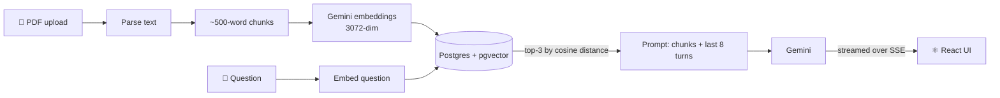

<div align="center">
  
</div>

<div align="center">
  
</div>

<div align="center">

[](https://singhshiv.netlify.app/)
[](https://www.linkedin.com/in/shiv-shankar-singh-/)
[](mailto:singhshiv0427@gmail.com)
[](https://x.com/1amWaziR)
[](https://leetcode.com/u/shiv0427/)


</div>

---

## 👋 Hi, I'm Shiv

I'm a **full-stack developer** from **Bengaluru, India** who builds with **React, Node.js, Express, MongoDB and PostgreSQL**, and I've spent the last few months going deep on **how AI backends actually work**: embeddings, vector search, RAG, conversation memory, streaming and structured LLM output.

I like building things end to end and shipping them. Every project below is **live**, deployed on free-tier infrastructure, and has a README that explains the *why* behind the decisions, not just the features.

```ts
const shiv = {
  role: "Full-Stack Developer",
  basedIn: "Bengaluru, India 🇮🇳",
  education: "B.Tech CSE, Lovely Professional University (2024)",
  stack: ["TypeScript", "React", "Node.js", "Express", "PostgreSQL", "MongoDB"],
  ai: ["RAG", "Embeddings", "pgvector", "SSE streaming", "Structured output + Zod"],
  nowLearning: ["BullMQ + Redis", "Agents & tool calling", "Vitest + Supertest", "Docker"],
  consistency: "300+ day GitHub streak · 100+ days of DSA",
  openTo: ["Full-Stack", "AI Backend", "Frontend"],
};
```

---

## 🧠 Flagship: DocMind

<table>
<tr>
<td>

### [DocMind: Chat With Your PDFs](https://docmind-jet.vercel.app/)

**Upload a PDF, chat with it, get quizzed on it.** An AI backend built from scratch to understand how AI products work under the hood. No LangChain, no LLM SDK: just Express, Postgres and plain HTTP calls to Gemini, so every piece is visible.

`TypeScript` `Express 5` `PostgreSQL` `pgvector` `Drizzle ORM` `Gemini API` `Zod` `Server-Sent Events` `React 19`

[](https://docmind-jet.vercel.app/)
[](https://ai-backend-docmind.onrender.com/)
[](https://github.com/sh1v-max/AI-Backend)

</td>
</tr>
</table>



- 📄 **Ingestion pipeline:** PDF → text → chunks → **Gemini embeddings (3072-dim)** → **pgvector**, each chunk tagged with its document
- 🔍 **RAG chat** over one PDF or all of them, with the source passages (and which file they came from) shown under every answer
- 🧵 **Conversation memory** in Postgres: the last 8 turns go into every prompt, and a page refresh resumes the same chat
- ⚡ **Live streaming over SSE**, parsed by hand from Gemini's raw byte stream with an async generator
- 📝 **Quiz generation** with Gemini's structured-output mode, **validated with Zod**, retried once on bad output, options shuffled in code, graded in the browser
- ☁️ Deployed on free tier: API on **Render**, frontend on **Vercel**, Postgres on **Neon**

<details>
<summary><b>🔎 Engineering decisions worth knowing</b></summary>
<br>

- **Validate the model like any untrusted client.** Every quiz goes through a Zod schema before it's used. The model was valid 17/17 times in testing, so it's insurance, and a gallery of deliberately broken replies proves what it catches.
- **Valid isn't the same as good.** Across 50 generated questions the correct answer landed unevenly (one slot 36%, another 10%), so options are shuffled in code (Fisher–Yates) after validation instead of trusting the model's habits.
- **Retry once, then fail honestly.** Two attempts max, then a clean `502`. Never an endless loop.
- **Errors travel inside the stream.** Once an SSE response starts, its status code is already sent, so failures go out as an in-band `error` event.
- **Readable errors.** A failed vector query from Drizzle dumps all 3072 embedding numbers. A small helper prints just the message, the underlying cause, and the line in the codebase where it broke.
- **Routes → services → repositories.** Only repositories touch SQL, and services never touch `req`/`res`, so the same pipelines can later run inside a background worker.

</details>

> ⏳ The API is on Render's free tier, so the first request after it's been idle can take up to a minute while it wakes up.

---

## 🚀 Featured Projects

<table>
<tr>
<td width="50%" valign="top">

### 🎬 [Cinegraph](https://cinewatchgraph-ai.web.app)
**AI movie, TV & anime recommender**

`React 19` `Redux Toolkit` `Firebase` `Gemini API` `Cloudflare Workers` `TMDB` `Tailwind v4`

- 🔐 Gemini key kept server-side in a **Cloudflare Worker proxy** with a CORS allow-list and input caps
- ✅ Model returns strict JSON, and every title is **cross-checked against TMDB**, so no hallucinated picks reach the UI
- 🎯 **Taste profile** from your likes/dislikes (top genres, genres to avoid, favorite decade) fed into the prompt
- 💬 **Multi-turn follow-ups** ("more like the third one") and three personalized "For You" rows
- 🔥 Firebase Auth + Firestore with owner-only security rules

[](https://cinewatchgraph-ai.web.app)
[](https://github.com/sh1v-max/CineGraph)

</td>
<td width="50%" valign="top">

### ⚙️ [TaskForge](https://taskforge-eight-xi.vercel.app)
**Secured REST API + React task manager**

`Node.js` `Express 5` `MongoDB` `JWT` `Zod` `Swagger` `React 19` `GitHub Actions`

- 🔐 **JWT + bcrypt** auth, and every query scoped to its owner, so users only ever see their own data
- 🛡️ **Zod** on bodies and query strings, Helmet, locked-down CORS, proxy-aware **rate limiting** (100 req / 15 min)
- 📄 Interactive **Swagger / OpenAPI** docs
- 🔍 Server-side **filtering, sorting and pagination**
- 🔁 **GitHub Actions CI**, auto-deploys to Render (API) and Vercel (frontend)

[](https://taskforge-eight-xi.vercel.app)
[](https://taskforge-api-e2g9.onrender.com/api/docs)
[](https://github.com/sh1v-max/Taskforge)

</td>
</tr>
<tr>
<td width="50%" valign="top">

### 🥘 [BharatDiet](https://bharat-diet.vercel.app)
**Personalized nutrition for real Indian food**

`React 19` `Vite` `Tailwind v4` `React Router 7` `Vitest`

- 🍛 **Meal planner** matched to your calories, protein target, region, diet type and daily budget in ₹
- 🧮 Greedy meal allocator with a protein-boost pass and portion reconciliation ("2 roti → 2.5 roti")
- 📊 **200+ Indian foods** with real serving sizes, macros and cost, sortable by protein-per-rupee
- 🧪 **Vitest suite:** nutrition formulas, dataset validation, and every region × diet × budget × goal combination
- 🔓 Runs fully client-side: no account, no tracking

[](https://bharat-diet.vercel.app)
[](https://github.com/sh1v-max/BharatDiet)

</td>
<td width="50%" valign="top">

### 🍕 [BiteSwift](https://yourbiteswift.netlify.app/)
**Swiggy-style food delivery app**

`React 19` `Redux Toolkit` `React Router` `Parcel` `Netlify Functions`

- 🛒 **Redux Toolkit cart** with quantities, a bill breakdown (GST, fees, coupons) and a simulated checkout
- 🌐 **Netlify Functions proxy** for Swiggy's listing API, which sends no CORS headers
- 🧯 Menus blocked by bot protection **fall back to mock data in the exact same shape**, so the app never breaks
- 💡 Shimmer loading, lazy-loaded routes, custom hooks

[](https://yourbiteswift.netlify.app/)
[](https://github.com/sh1v-max/BiteSwift)

</td>
</tr>
</table>

### 🧩 More builds

| Project | What it is | Stack | Links |
|---|---|---|---|
| 🌐 **Portfolio** | 6 themes (WCAG AA checked), live GitHub dashboard with a contribution calendar, project case studies, 33 UI experiments, contact form via a Netlify Function | React, Vite, Tailwind v4, Framer Motion | [Live](https://singhshiv.netlify.app/) · [Code](https://github.com/sh1v-max/My-portfolio-2.0) |
| 📚 **BookVerse** | Book discovery with debounced search by title, author or genre, trending lists and detailed book pages | React, Tailwind CSS, Open Library API | [Live](https://bookversedot.netlify.app/) · [Code](https://github.com/sh1v-max/BookVerse) |
| 🗺️ **Where Is Your Country** | One of my early builds for exploring countries of the world | JavaScript | [Live](https://whereisyourcountry.netlify.app) |

---

## 🛠️ Tech Stack

<table>
<tr><td><b>Languages</b></td><td>


</td></tr>
<tr><td><b>Frontend</b></td><td>


</td></tr>
<tr><td><b>Backend &amp; Data</b></td><td>


</td></tr>
<tr><td><b>DevOps &amp; Tools</b></td><td>


</td></tr>
<tr><td><b>AI &amp; Libraries</b></td><td>


</td></tr>
<tr><td><b>Learning now</b></td><td>


</td></tr>
</table>

---

## 🧭 How I Build

- **Understand it, then build the smallest real version.** DocMind has no framework doing the interesting parts on purpose, so I know what RAG, streaming and structured output look like underneath.
- **Treat model output as untrusted input.** Validate it with a schema, cross-check it against real data, and never let a hallucinated result reach the user.
- **Secrets stay on the server.** API keys live behind a proxy or backend, never in the browser bundle.
- **Ship it, then document the why.** Every project is deployed and has a README that explains the tradeoffs, including known limitations.
- **Free-tier first.** Render, Vercel, Netlify, Neon, Firebase and Cloudflare Workers, no card required.

---

## 📊 GitHub Stats

<div align="center">
  
  
</div>

<div align="center">
  
</div>

<div align="center">
  
</div>

---

## 🤝 Let's Connect

<div align="center">

I'm **open to Full-Stack and AI Backend roles**. If you're building something with LLMs, APIs or real users, I'd love to talk.

[](mailto:singhshiv0427@gmail.com)
[](https://www.linkedin.com/in/shiv-shankar-singh-/)
[](https://singhshiv.netlify.app/)
[](https://x.com/1amWaziR)
[](https://leetcode.com/u/shiv0427/)

</div>

<div align="center">
  
</div>
